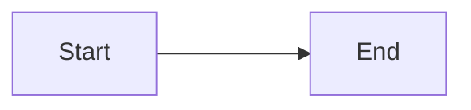
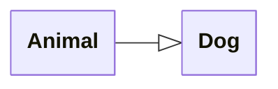
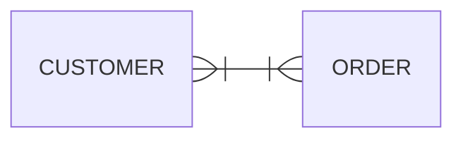

# Mermaid Builder

[](https://github.com/earth-metabolome-initiative/mermaid-builder/actions)
[](https://github.com/earth-metabolome-initiative/mermaid-builder/actions)
[](https://opensource.org/licenses/MIT)
[](https://codecov.io/gh/earth-metabolome-initiative/mermaid-builder)
[](https://crates.io/crates/mermaid-builder)
[](https://docs.rs/mermaid-builder)

**Mermaid Builder** is a Rust crate for generating [Mermaid](https://mermaid.js.org/) diagram syntax. It uses a builder pattern to provide a type-safe API, allowing you to define diagrams programmatically in Rust. You can then export these diagrams as strings to be rendered by Mermaid tools.

## Examples

### Flowchart

Flowcharts represent workflows or processes using nodes (shapes) and edges (arrows).

For more details on the Rust implementation, check the documentation for [`FlowchartBuilder`](https://docs.rs/mermaid-builder/latest/mermaid_builder/diagrams/flowchart/struct.FlowchartBuilder.html), [`FlowchartNodeBuilder`](https://docs.rs/mermaid-builder/latest/mermaid_builder/diagrams/flowchart/struct.FlowchartNodeBuilder.html), [`FlowchartEdgeBuilder`](https://docs.rs/mermaid-builder/latest/mermaid_builder/diagrams/flowchart/struct.FlowchartEdgeBuilder.html), and [`Flowchart`](https://docs.rs/mermaid-builder/latest/mermaid_builder/diagrams/flowchart/struct.Flowchart.html).

For more information about the Mermaid syntax, please refer to the [Mermaid Flowchart documentation](https://mermaid.js.org/syntax/flowchart.html).

```rust
use mermaid_builder::prelude::*;

fn main() -> Result<(), Box<dyn std::error::Error>> {
    let mut builder = FlowchartBuilder::default();

    // Create nodes
    let node1 = builder
        .node(FlowchartNodeBuilder::default().label("Start")?)?;
    let node2 = builder
        .node(FlowchartNodeBuilder::default().label("End")?)?;

    // Create edge
    builder
        .edge(
            FlowchartEdgeBuilder::default()
                .source(node1)?
                .destination(node2)?
                .right_arrow_shape(ArrowShape::Normal)?
        )?;

    // Build the flowchart
    let flowchart = Flowchart::from(builder);

    // Print the mermaid syntax
    println!("{}", flowchart);

    let expected = r#"flowchart LR
  v0@{shape: rect, label: "Start"}
  v1@{shape: rect, label: "End"}
  v0 ---> v1
"#;
    assert_eq!(flowchart.to_string(), expected);
    Ok(())
}
```

Output:



### Class Diagram

Class diagrams describe the structure of a system by showing classes, their attributes, methods, and relationships.

For more details on the Rust implementation, check the documentation for [`ClassDiagramBuilder`](https://docs.rs/mermaid-builder/latest/mermaid_builder/diagrams/class_diagram/type.ClassDiagramBuilder.html), [`ClassNodeBuilder`](https://docs.rs/mermaid-builder/latest/mermaid_builder/diagrams/class_diagram/class_node/struct.ClassNodeBuilder.html), [`ClassEdgeBuilder`](https://docs.rs/mermaid-builder/latest/mermaid_builder/diagrams/class_diagram/class_edge/builder/struct.ClassEdgeBuilder.html), and [`ClassDiagram`](https://docs.rs/mermaid-builder/latest/mermaid_builder/diagrams/class_diagram/type.ClassDiagram.html).

For more information about the Mermaid syntax, please refer to the [Mermaid Class Diagram documentation](https://mermaid.js.org/syntax/classDiagram.html).

```rust
use mermaid_builder::prelude::*;

fn main() -> Result<(), Box<dyn std::error::Error>> {
    let mut builder = ClassDiagramBuilder::default();

    // Create class nodes
    let animal = builder
        .node(ClassNodeBuilder::default().label("Animal")?)?;
    let dog = builder
        .node(ClassNodeBuilder::default().label("Dog")?)?;

    // Create inheritance edge
    builder
        .edge(
            ClassEdgeBuilder::default()
                .source(animal)?
                .destination(dog)?
                .right_arrow_shape(ArrowShape::Triangle)?
        )?;

    let class_diagram = ClassDiagram::from(builder);
    println!("{}", class_diagram);

    let expected = r#"---
config:
  class:
    hideEmptyMembersBox: "false"
---
classDiagram
  direction LR
  class v0["Animal"] {
  }
  class v1["Dog"] {
  }
  v0 --|> v1
"#;
    assert_eq!(class_diagram.to_string(), expected);
    Ok(())
}
```

Output:



### Entity Relationship Diagram

Entity Relationship (ER) diagrams model entities and the relationships between them. They are commonly used to design database schemas.

For more details on the Rust implementation, check the documentation for [`ERDiagramBuilder`](https://docs.rs/mermaid-builder/latest/mermaid_builder/diagrams/entity_relationship/type.ERDiagramBuilder.html), [`ERNodeBuilder`](https://docs.rs/mermaid-builder/latest/mermaid_builder/diagrams/entity_relationship/entity_relationship_node/struct.ERNodeBuilder.html), [`EREdgeBuilder`](https://docs.rs/mermaid-builder/latest/mermaid_builder/diagrams/entity_relationship/entity_relationship_edge/type.EREdgeBuilder.html), and [`ERDiagram`](https://docs.rs/mermaid-builder/latest/mermaid_builder/diagrams/entity_relationship/type.ERDiagram.html).

For more information about the Mermaid syntax, please refer to the [Mermaid Entity Relationship Diagram documentation](https://mermaid.js.org/syntax/entityRelationshipDiagram.html).

```rust
use mermaid_builder::prelude::*;

fn main() -> Result<(), Box<dyn std::error::Error>> {
    let mut builder = ERDiagramBuilder::default();

    let customer = builder
        .node(ERNodeBuilder::default().label("CUSTOMER")?)?;
    let order = builder
        .node(ERNodeBuilder::default().label("ORDER")?)?;

    // Create relationship
    builder
        .edge(EREdgeBuilder::one_or_more(customer, order))?;

    let er_diagram = ERDiagram::from(builder);
    println!("{}", er_diagram);

    let expected = r#"---
config:
  layout: dagre
  theme: default
  look: classic
---
erDiagram
  direction LR
  v0["CUSTOMER"]
  v1["ORDER"]
  v0 }|--|{ v1 : ""
"#;
    assert_eq!(er_diagram.to_string(), expected);
    Ok(())
}
```

Output:



## Contributing

Contributions are welcome! Please feel free to submit a Pull Request.

## License

This project is licensed under the MIT License.
